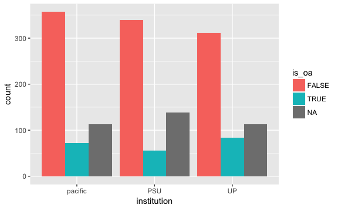

Pull Data
================
Jessica Minnier
2018-06-18

Read Data
=========

``` r
tmpborrow <- read_excel(
  here("Pacific","Pacific-Borrowing articles 2016 2017 filled and cancelled.xlsx"),
  sheet = "Pacific_Borrowing_Sample")%>%janitor::clean_names()

tmplending <- read_excel(
  here("Pacific","Pacific-Lending Articles 2016 2017 Filled and Cancelled or Conditionaled.xlsx"),
  sheet = "Pacific_Lending_Sample")%>%janitor::clean_names()

pacific = bind_rows("borrow"=tmpborrow,"lending"=tmplending,.id = "type")%>%
  add_column(institution="pacific",.before = "type")

tmpborrow <- read_excel(
  here("PSU","PSU 2017articlesborrowing.xlsx"),
  sheet = "PSU_Borrowing_Sample",
  na = c("","N/A"))%>%janitor::clean_names()

tmplending <- read_excel(
  here("PSU","Copy of PSU 2017articleslending.xlsx"),
  sheet = "PSU_Lending_Sample",
  na = c("","N/A"))%>%janitor::clean_names()

psu = bind_rows("borrow"=tmpborrow,"lending"=tmplending,.id = "type")%>%
  add_column(institution="PSU",.before = "type")


tmpborrow <- read_excel(
  here("UofP","UP16-17_borrowing_articles.xlsx"),
  sheet = "UP_Borrowing_Sample",
  na = c("","N/A"))%>%janitor::clean_names()

tmplending <- read_excel(
  here("UofP","UP16_17_lending_articles.xlsx"),
  sheet = "UP_Lending_Sample",
  na = c("","N/A"))%>%janitor::clean_names()

uofp = bind_rows("borrow"=tmpborrow,"lending"=tmplending,.id = "type")%>%
  add_column(institution="UP",.before = "type") 

alldata = bind_rows(pacific,psu)
alldata = bind_rows(alldata,uofp)
alldata = alldata%>%mutate(
  doi=ifelse(substr(doi,1,1)=="0",paste0("1",doi),doi), # some dois start with 0, assuming need a 10 instead
  doi=gsub("\n","",doi), #\n at end of doi causes issues
  doi=gsub("doi:","",doi), #one had doi: in front
  doi=gsub("Get rights and content","",doi),
  doi_input = doi, # UP added non-dois to doi column, so removing these from query to save time
  doi=ifelse(substr(doi,1,1)=="1",doi,NA)
)
```

Number of unique DOIs:

``` r
length(unique(alldata$doi))
```

    #> [1] 1232

``` r
alldata%>%tabyl(institution)%>%adorn_pct_formatting()
```

    #>  institution   n percent
    #>      pacific 542   34.2%
    #>          PSU 533   33.7%
    #>           UP 508   32.1%

``` r
alldata%>%tabyl(institution,type)
```

    #>  institution borrow lending
    #>      pacific    262     280
    #>          PSU    278     255
    #>           UP    270     238

Unpaywall
=========

API: <http://unpaywall.org/api/v2>

``` r
url  <- "https://api.unpaywall.org/"
path <- "/v2/"
email <- "minnier@ohsu.edu"
```

get the result in JSON

``` r
raw.result <- GET(url = url, path = path)
raw.result
```

    #> Response [https://api.unpaywall.org/v2/]
    #>   Date: 2018-06-19 04:56
    #>   Status: 200
    #>   Content-Type: application/json
    #>   Size: 103 B
    #> {
    #>   "documentation_url": "https://unpaywall.org/api/v2",
    #>   "msg": "Don't panic",
    #>   "version": "2.0.1"

``` r
names(raw.result)
```

    #>  [1] "url"         "status_code" "headers"     "all_headers" "cookies"    
    #>  [6] "content"     "date"        "times"       "request"     "handle"

Make a function that creates an appended path

``` r
makePath <- function(classifier) {
  classifier = paste0("/v2/",classifier,"?email=",email)
  return(classifier)
}
```

make a query out of a list of articles

``` r
# make stacked data frame of all queried data sets
# add column query_used to choose doi or some other identifier
query_dois  <- unique(na.omit(alldata$doi))
query_paths <- lapply(as.list(query_dois), makePath)
```

Some testing, one article first Note this is different than OA button since it is not of the form ?url=, and also we need /v2/ which has to be input into path not url (or else it goes away for some reason).

``` r
# should be
# https://api.unpaywall.org/v2/10.1371/journal.pone.0163591?email=minnier@ohsu.edu
# raw.result.test = GET(url = url, path = path, query = list(url=unlist(queryart$articles[2])))
raw.result = GET(url = url, path = query_paths[[2]])
names(raw.result)
```

    #>  [1] "url"         "status_code" "headers"     "all_headers" "cookies"    
    #>  [6] "content"     "date"        "times"       "request"     "handle"

``` r
this.raw.content <- rawToChar(raw.result$content)
this.content <- fromJSON(this.raw.content)
names(this.content)
```

    #>  [1] "best_oa_location"   "data_standard"      "doi"               
    #>  [4] "doi_url"            "genre"              "is_oa"             
    #>  [7] "journal_is_in_doaj" "journal_is_oa"      "journal_issns"     
    #> [10] "journal_name"       "oa_locations"       "published_date"    
    #> [13] "publisher"          "title"              "updated"           
    #> [16] "year"               "z_authors"

``` r
this.content$best_oa_location$url
```

    #> NULL

``` r
# test map
all_content = list(this.content,this.content)
# note, map_df + extract doesn't work if there is an error since these fields are not present, need to adapt this in the extract function
purrr::map_df(all_content,magrittr::extract,
              c("doi","is_oa","journal_is_in_doaj","data_standard","title"))
```

    #> # A tibble: 2 x 5
    #>   doi               is_oa journal_is_in_doaj data_standard title          
    #>   <chr>             <lgl> <lgl>                      <int> <chr>          
    #> 1 10.1159/000308973 FALSE FALSE                          2 The Effect of …
    #> 2 10.1159/000308973 FALSE FALSE                          2 The Effect of …

``` r
# function to extract OA availability, main contect, after fromJSON
extract_unpaywall_data = function(rawcontent) {
  rawcontent = jsonlite:::null_to_na(rawcontent)
  main_names = c("doi","is_oa","journal_is_in_doaj","data_standard","title")
  
  # first check for error
  if(length(rawcontent$HTTP_status_code)>0){
    error = TRUE
    message = rawcontent$message
    main_data <- matrix(NA,nrow=1,ncol=length(main_names),dimnames = list(NULL,main_names))%>%as_tibble()
    oa_avail <- data_frame(url=NA)
  }else{
    error = FALSE
    message = ifelse(is.null(rawcontent$message),NA,rawcontent$message) # likely null
    
    # get info
    main_data = rawcontent%>%magrittr::extract(main_names)%>%as_tibble()
    
    if(!is.na(rawcontent$best_oa_location[1])){
      oa_avail <- bind_cols(as_data_frame(rawcontent$best_oa_location$url),
                            data_frame(
                              evidence=rawcontent$best_oa_location$evidence,
                              host_type=rawcontent$best_oa_location$host_type))%>%
        rename(url=value)
    }else{
      oa_avail <- data_frame(url=NA) # could still add title rawcontent$title
    }
  }
  bind_cols(main_data,oa_avail)%>%add_column(error=error,message=message)
}
extract_unpaywall_data(fromJSON(rawToChar(raw.result$content)))
```

    #> # A tibble: 1 x 8
    #>   doi    is_oa journal_is_in_d… data_standard title    url   error message
    #>   <chr>  <lgl> <lgl>                    <int> <chr>    <lgl> <lgl> <lgl>  
    #> 1 10.11… FALSE FALSE                        2 The Eff… NA    FALSE NA

``` r
#extract_unpaywall_data(fromJSON(rawToChar(GET(url = url, path = "/v2/test")))) # should be NAs

tmp = GET(url = url, path = "/v2/10.1615/CritRevPhysRehabilMed.2015012338?email=minnier@ohsu.edu")
extract_unpaywall_data(fromJSON(rawToChar(tmp$content)))
```

    #> # A tibble: 1 x 8
    #>   doi    is_oa journal_is_in_d… data_standard title    url   error message
    #>   <chr>  <lgl> <lgl>                    <int> <chr>    <lgl> <lgl> <lgl>  
    #> 1 10.16… FALSE FALSE                        2 Short-T… NA    FALSE NA

``` r
# should get an error message
tmp = GET(url = url, path = "/v2/10.1615/CritRevPhysRehabilMed.201301029?email=minnier@ohsu.edu")
extract_unpaywall_data(fromJSON(rawToChar(tmp$content)))
```

    #> # A tibble: 1 x 8
    #>   doi   is_oa journal_is_in_doaj data_standard title url   error message  
    #>   <lgl> <lgl> <lgl>              <lgl>         <lgl> <lgl> <lgl> <chr>    
    #> 1 NA    NA    NA                 NA            NA    NA    TRUE  '10.1615…

Now try all queries

``` r
unpaywall_raw <- vector(mode   = "list",
                        length = length(query_paths))
length(unpaywall_raw)
```

    #> [1] 1231

make sure 1 request per second

``` r
safe_fromJSON = safely(fromJSON)

tryload = try(load(here("results","unpaywall_raw.RData")))
if(class(tryload)=="try-error"){
  t0 <- Sys.time()
  for (i in 1:length(unpaywall_raw)) {
    this.path        <- query_paths[[i]]
    raw <- GET(url = url, path = this.path)
    unpaywall_raw[[i]] <- safe_fromJSON(rawToChar(raw$content))
    message(".", appendLF = FALSE)
    Sys.sleep(time = 1)
  }
  Sys.time()-t0

  unpaywall_raw0 = unpaywall_raw
  unpaywall_error = unpaywall_raw%>%map(magrittr::extract2,"error")
  unpaywall_raw = unpaywall_raw%>%map(magrittr::extract2,"result")
  names(unpaywall_error) = names(unpaywall_raw) = query_dois
  
  # if length==3, there was an error captured by openpaywall; if length==0, there was an application error
  unpaywall_raw%>%map_int(length)%>%table() 
  unpaywall_error%>%map_int(length)%>%table() 
  
  save(unpaywall_raw,unpaywall_error,file=here("results","unpaywall_raw.RData"))
}

#jsonlite:::null_to_na(unpaywall_raw)[[2]]
main_res     <- unpaywall_raw%>%map_df(extract_unpaywall_data,.id="query")
# main_res  <- purrr::map(unpaywall_raw,magrittr::extract,
#                           c("doi","is_oa","journal_is_in_doaj","data_standard","title"))
# main_res  <- main_res%>%purrr::discard(is.null)
res       <- left_join(alldata%>%mutate(query=doi),main_res%>%rename(doi_unpaywall=doi),by="query")
```

write to a file:

``` r
write_csv(res,
          path=here::here("results",paste0(lubridate::today(),"_unpaywall.csv")))


res%>%tabyl(type,error)%>%adorn_title()
```

    #>          error         
    #>     type FALSE TRUE NA_
    #>   borrow   579    9 222
    #>  lending   640   11 122

``` r
res%>%tabyl(is_oa)%>%adorn_title()%>%adorn_percentages()
```

    #>                                              NA
    #>  is_oa    n           percent     valid_percent
    #>  FALSE 1009 0.637397346809855 0.827727645611157
    #>   TRUE  210 0.132659507264687 0.172272354388843
    #>   <NA>  364 0.229943145925458              <NA>

``` r
res %>% ggplot(aes(x=institution,fill=is_oa)) + geom_bar(position = "dodge")
```



``` r
# is_oa is null when either the doi was missing so could  not submit to unpaywall, or if there was an error (invalid doi usually)

# add flag for why is_oa is missing: missing doi in input vs invalid doi
```
