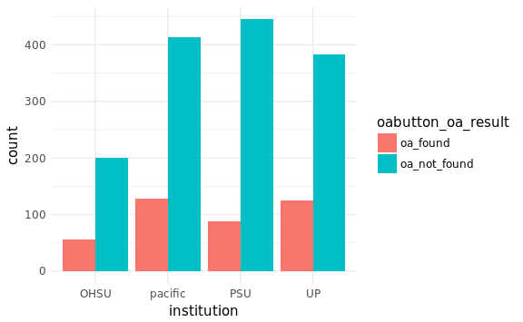

Pull OA Button Data
================
Jessica Minnier
2018-08-10

Read Data
=========

``` r
source(here("code","00-clean_input_data.R"))
```

Number of samples per institution:

``` r
alldata%>%tabyl(institution)%>%adorn_pct_formatting()%>%adorn_totals()
```

| institution |     n| percent |
|:------------|-----:|:--------|
| pacific     |   542| 34.2%   |
| PSU         |   533| 33.7%   |
| UP          |   508| 32.1%   |
| Total       |  1583| -       |

``` r
alldata%>%tabyl(institution,type)%>%adorn_totals()
```

| institution |  borrow|  lending|
|:------------|-------:|--------:|
| pacific     |     262|      280|
| PSU         |     278|      255|
| UP          |     270|      238|
| Total       |     810|      773|

Number of unique DOIs:

``` r
length(unique(alldata$doi))
```

    #> [1] 1232

A few DOIs show up twice:

``` r
tmp = sort(table(alldata$doi),decreasing = TRUE)
tmp[tmp>1]
```

|  10.1016/0045-7930(86)90013-7|  10.1016/0091-3057(84)90199-0|  10.1016/S0304-3878(02)00131-1|  10.1080/00141844.2015.1028564|  10.1080/02687030902732745|  10.1097/HRP.0000000000000100|  10.1177/1747954116655049|  10.3109/01612840.2015.1055020|
|-----------------------------:|-----------------------------:|------------------------------:|------------------------------:|--------------------------:|-----------------------------:|-------------------------:|------------------------------:|
|                             2|                             2|                              2|                              2|                          2|                             2|                         2|                              2|

Open Access Button
==================

Info: <https://openaccessbutton.org/api>

``` r
url  <- "https://api.openaccessbutton.org"
path <- "/"
get_apikey <- try(load(file="~/Dropbox/oabutton_apikey.RData")) # apikey
if(class(get_apikey)=="try-error") {apikey <- ""} # for others running
```

A blank query. Get the result in JSON

``` r
raw.result <- GET(url = url, path = path)
raw.result
```

    #> Response [https://api.openaccessbutton.org/]
    #>   Date: 2018-08-10 23:40
    #>   Status: 200
    #>   Content-Type: application/json; charset=utf-8
    #>   Size: 43 B
    #> {
    #>   "data": "The Open Access Button API."

``` r
names(raw.result)
```

    #>  [1] "url"         "status_code" "headers"     "all_headers" "cookies"    
    #>  [6] "content"     "date"        "times"       "request"     "handle"

``` r
path <- "availability"
```

Need to make a function that creates the appropriate URL

``` r
# Note: need to encode just classifier or else it doesn't work in api
makeQuery <- function(classifier, name="url") {
  classifier = paste0(url,"/",path,"?",name,"=",urltools::url_encode(classifier),"&apikey=",apikey)
  return(classifier)
}
```

Make a query out of a list of articles; if DOI not available, use title.

``` r
alldata = alldata %>% 
  mutate(query=ifelse(is.na(doi),article_title,doi),
         queryname=ifelse(is.na(doi),"title","doi")) %>% 
  mutate(query=ifelse(is.na(query),photo_article_title,query),
         queryname=ifelse(is.na(query),"title",queryname))

query_data  <- alldata%>%select(query,queryname) %>% filter(!is.na(query)) %>% unique %>% 
  add_column(url=url,apikey=apikey,path=path) %>%
  mutate(
    query_nice = urltools::url_encode(query),
    query_path = (glue::glue("{url}/{path}?{queryname}={query_nice}&apikey={apikey}")))

nrow(alldata)
```

    #> [1] 1583

``` r
nrow(query_data)
```

    #> [1] 1575

``` r
queries <- query_data$query_path
```

Some testing, one article first

``` r
# should be
# https://api.openaccessbutton.org/availability?url=http%3A%2F%2Fjournals.plos.org%2Fplosone%2Farticle%3Fid%3Dinfo%253Adoi%2F10.1371%2Fjournal.pone.0163591
# raw.result.test = GET(url = url, path = path, query = list(url=unlist(alldata$doi[1])))
# raw.result = GET(makeQuery("10.1371/journal.pone.0163591")) # example
# raw.result = GET(queries[[191]]) # a title
raw.result = GET(queries[[28]]) # a doi with OA
names(raw.result)
```

    #>  [1] "url"         "status_code" "headers"     "all_headers" "cookies"    
    #>  [6] "content"     "date"        "times"       "request"     "handle"

``` r
this.raw.content <- rawToChar(raw.result$content)
this.content <- fromJSON(this.raw.content)
this.content$data$availability
```

| type    | url                                        |
|:--------|:-------------------------------------------|
| article | <http://europepmc.org/articles/PMC3348500> |

``` r
rawcontent = this.content # for testing
extract_availibility = function(rawcontent) {
  if(length(rawcontent$data$availability)>0){
    bind_cols(data_frame(match=rawcontent$data$match),
              as_data_frame(rawcontent$data$availability),
              data_frame(
                source=rawcontent$data$meta$article$source,
                title=ifelse(length(rawcontent$data$meta$article$title)>0,rawcontent$data$meta$article$title,NA) # not always available
                ))
  }else{
    bind_cols(data_frame(match=rawcontent$data$match),url=NA)
  }
}
extract_availibility(this.content)
```

| match                                       | type    | url                                        | source | title |
|:--------------------------------------------|:--------|:-------------------------------------------|:-------|:------|
| <https://doi.org/10.1016/j.cub.2012.03.023> | article | <http://europepmc.org/articles/PMC3348500> | eupmc  | NA    |

Testing the extraction function:

``` r
raw = GET(queries[[6]])
extract_availibility(fromJSON(rawToChar(raw$content)))
```

| match                                       | url |
|:--------------------------------------------|:----|
| <https://doi.org/10.1001/archpsyc.60.3.303> | NA  |

``` r
raw = GET(makeQuery("10.1016/j.chemosphere.2016.06.071"))
extract_availibility(fromJSON(rawToChar(raw$content)))
```

| match                                               | type    | url                                                                           | source | title |
|:----------------------------------------------------|:--------|:------------------------------------------------------------------------------|:-------|:------|
| <https://doi.org/10.1016/j.chemosphere.2016.06.071> | article | <https://manuscript.elsevier.com/S0045653516308293/pdf/S0045653516308293.pdf> | oadoi  | NA    |

``` r
raw = GET(makeQuery("Using aquatic vegetation to remediate nitrate, ammonium, and soluble reactive
2 phosphorus in simulated runoff",name="title"))
extract_availibility(fromJSON(rawToChar(raw$content)))
```

| match                                                                                                                 | type    | url | source | title |
|:----------------------------------------------------------------------------------------------------------------------|:--------|:----|:-------|:------|
| TITLE:Using aquatic vegetation to remediate nitrate, ammonium, and soluble reactive                                   |         |     |        |       |
| 2 phosphorus in simulated runoff article <https://manuscript.elsevier.com/S0045653516308293/pdf/S0045653516308293.pd> | f oadoi | NA  |        |       |

Now try all queries

``` r
tryload = try(load(here("results",oabutton_datafile)))
if((class(tryload)=="try-error")||(update_raw_data)){

  oabutton_raw <- vector(mode   = "list",
                         length = length(queries))
  safe_fromJSON = safely(fromJSON)
  
  #' make sure 1 request per second

  t0 = Sys.time()
  for (i in 1:length(oabutton_raw)) {
    this.query       <- queries[[i]]
    raw              <- GET(this.query)
    oabutton_raw[[i]] <-  safe_fromJSON(rawToChar(raw$content))
    message(".", appendLF = FALSE)
    if(i%%50==0) print(i)
    Sys.sleep(time = 1)
  }
  Sys.time()-t0
  
  names(oabutton_raw) = query_data$query
  oabutton_raw0 <- oabutton_raw
  oabutton_error <- oabutton_raw0%>%map(magrittr::extract2,"error")
  oabutton_raw <- oabutton_raw0%>%map(magrittr::extract2,"result")
  names(oabutton_error) <- names(oabutton_raw) <- query_data$query
  rm(oabutton_raw0)
  
  save(oabutton_raw, oabutton_error, file=here("results",oabutton_datafile))
}

main_res     <- oabutton_raw%>%map_df(extract_availibility,.id="query")
```

Note OA button finds a doi for this but it doesn't match the title nor the author; could be other examples of this?

``` r
main_res[259,]
```

| query                                                                                                                                                                                                                                                      | match                                              | url | type | source | title |
|:-----------------------------------------------------------------------------------------------------------------------------------------------------------------------------------------------------------------------------------------------------------|:---------------------------------------------------|:----|:-----|:-------|:------|
| Does early intervention for psychosis work? An analysis of outcomes of early intervention in psychosis based on the critical period hypothesis, measured by number of admissions and bed days used over a period of six years, the first three in an early | <https://doi.org/10.1097/00004850-199801001-00006> | NA  | NA   | NA     | NA    |

``` r
alldata[match(main_res$query[259],alldata$photo_article_title),]
```

| institution | type   | doi | photo\_article\_title                                                                                                                                                                                                                                      | photo\_journal\_title | photo\_journal\_volume | photo\_journal\_issue | photo\_journal\_year | photo\_journal\_inclusive\_pages | photo\_article\_author | transaction\_status |  transaction\_date| issn      |  base\_fee| lending\_library | reason\_for\_cancellation | call\_number | location        | maxcost | document\_type | system\_id | ifm\_cost | copyright\_payment\_method | ccc\_number | copyright\_comp | article\_title | journal\_title | volume | issue | year | pages | article\_author | x\_1 | cited\_in |  creation\_date| photo\_item\_publisher | notes\_on\_access | notes | doi\_input |  doi\_present| query                                                                                                                                                                                                                                                      | queryname |
|:------------|:-------|:----|:-----------------------------------------------------------------------------------------------------------------------------------------------------------------------------------------------------------------------------------------------------------|:----------------------|:-----------------------|:----------------------|:---------------------|:---------------------------------|:-----------------------|:--------------------|------------------:|:----------|----------:|:-----------------|:--------------------------|:-------------|:----------------|:--------|:---------------|:-----------|:----------|:---------------------------|:------------|:----------------|:---------------|:---------------|:-------|:------|:-----|:------|:----------------|:-----|:----------|---------------:|:-----------------------|:------------------|:------|:-----------|-------------:|:-----------------------------------------------------------------------------------------------------------------------------------------------------------------------------------------------------------------------------------------------------------|:----------|
| pacific     | borrow | NA  | Does early intervention for psychosis work? An analysis of outcomes of early intervention in psychosis based on the critical period hypothesis, measured by number of admissions and bed days used over a period of six years, the first three in an early | Psychiatria Danubina. | 22 Suppl 1             | 1                     | 2010                 | S72-                             | Agius, Mark            | Request Finished    |           42704.42| 0353-5053 |         NA| OA               | NA                        | NA           | JOURNAL WEBSITE | NA      | Article        | OTH        | NA        | NA                         | NA          | US:CCL          | NA             | NA             | NA     | NA    | NA   | NA    | NA              | NA   | NA        |              NA| NA                     | NA                | NA    | NA         |             0| Does early intervention for psychosis work? An analysis of outcomes of early intervention in psychosis based on the critical period hypothesis, measured by number of admissions and bed days used over a period of six years, the first three in an early | title     |

``` r
main_res     <- main_res%>%mutate(
  oabutton_oa_result = case_when(
    is.na(source) ~ "oa_not_found",
    !is.na(source) ~ "oa_found")
)
```

Unique queries: OA found

``` r
main_res%>%tabyl(oabutton_oa_result)
```

| oabutton\_oa\_result |     n|    percent|
|:---------------------|-----:|----------:|
| oa\_found            |   370|  0.2349206|
| oa\_not\_found       |  1205|  0.7650794|

Merge with original data, some had missing or duplicate dois

``` r
res <- left_join(alldata,main_res%>%rename(oabutton_match=match,
                                           oabutton_url=url,
                                           oabutton_type=type,
                                           oabutton_title=title,
                                           oabutton_source=source),by="query")
# res <- res %>% mutate(
#   oabutton_oa_result = ifelse(is.na(oabutton_oa_result),"no_doi_or_title_input",oabutton_oa_result)
#   )
```

Write to a file:
----------------

``` r
res <- res %>% rename(oabutton_query=query,oabutton_queryname=queryname)

write_csv(res,
          path=here::here("results",oabutton_results_file))
```

OA Button OA results:
=====================

``` r
res%>%tabyl(oabutton_oa_result)
```

| oabutton\_oa\_result |     n|    percent|
|:---------------------|-----:|----------:|
| oa\_found            |   372|  0.2349968|
| oa\_not\_found       |  1211|  0.7650032|

``` r
res%>%tabyl(oabutton_oa_result,institution)%>%adorn_title()
```

|                      | institution |     |     |
|----------------------|:------------|-----|-----|
| oabutton\_oa\_result | pacific     | PSU | UP  |
| oa\_found            | 145         | 95  | 132 |
| oa\_not\_found       | 397         | 438 | 376 |

``` r
res%>%tabyl(oabutton_oa_result,type)%>%adorn_title()
```

|                      | type   |         |
|----------------------|:-------|---------|
| oabutton\_oa\_result | borrow | lending |
| oa\_found            | 189    | 183     |
| oa\_not\_found       | 621    | 590     |

``` r
res %>% ggplot(aes(x=institution,fill=oabutton_oa_result)) + geom_bar(position = "dodge") + 
  theme_minimal()
```



OA results: source
------------------

``` r
res%>%filter(oabutton_oa_result=="oa_found")%>%tabyl(oabutton_source)%>%
  adorn_totals()%>%
  adorn_pct_formatting()
```

| oabutton\_source |    n| percent |
|:-----------------|----:|:--------|
| base             |  141| 37.9%   |
| BASE             |    2| 0.5%    |
| core             |    6| 1.6%    |
| doaj             |    3| 0.8%    |
| eupmc            |   75| 20.2%   |
| oadoi            |  145| 39.0%   |
| Total            |  372| 100.0%  |
