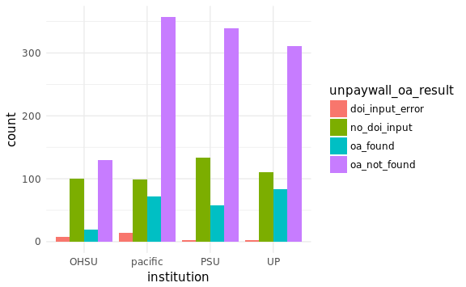

Pull Unpaywall Data
================
Jessica Minnier
2018-08-17

Read Data
=========

``` r
source(here("code","00-clean_input_data.R"))
```

Number of samples per institution:

``` r
alldata%>%tabyl(institution)%>%adorn_pct_formatting()%>%adorn_totals()
```

| institution |     n| percent |
|:------------|-----:|:--------|
| OHSU        |   256| 13.9%   |
| pacific     |   542| 29.5%   |
| PSU         |   533| 29.0%   |
| UP          |   508| 27.6%   |
| Total       |  1839| -       |

``` r
alldata%>%tabyl(institution,type)%>%adorn_totals()
```

| institution |  borrow|  lending|
|:------------|-------:|--------:|
| OHSU        |     256|        0|
| pacific     |     262|      280|
| PSU         |     278|      255|
| UP          |     270|      238|
| Total       |    1066|      773|

Number of unique DOIs:

``` r
length(unique(alldata$doi))
```

    #> [1] 1387

A few DOIs show up twice:

``` r
tmp = sort(table(alldata$doi),decreasing = TRUE)
tmp[tmp>1]
```

|  10.1016/0045-7930(86)90013-7|  10.1016/0091-3057(84)90199-0|  10.1016/S0304-3878(02)00131-1|  10.1055/s-2007-1011046|  10.1080/00141844.2015.1028564|  10.1080/02687030902732745|  10.1097/HRP.0000000000000100|  10.1177/1747954116655049|  10.3109/01612840.2015.1055020|
|-----------------------------:|-----------------------------:|------------------------------:|-----------------------:|------------------------------:|--------------------------:|-----------------------------:|-------------------------:|------------------------------:|
|                             2|                             2|                              2|                       2|                              2|                          2|                             2|                         2|                              2|

Unpaywall API
=============

API: <http://unpaywall.org/api/v2>

``` r
url  <- "https://api.unpaywall.org/"
path <- "/v2/"
email <- "minnier@ohsu.edu"
```

get the result in JSON

``` r
raw_result <- GET(url = url, path = path)
raw_result
```

    #> Response [https://api.unpaywall.org/v2/]
    #>   Date: 2018-08-17 22:44
    #>   Status: 200
    #>   Content-Type: application/json
    #>   Size: 103 B
    #> {
    #>   "documentation_url": "https://unpaywall.org/api/v2",
    #>   "msg": "Don't panic",
    #>   "version": "2.0.1"

``` r
names(raw_result)
```

    #>  [1] "url"         "status_code" "headers"     "all_headers" "cookies"    
    #>  [6] "content"     "date"        "times"       "request"     "handle"

Make a function that creates an appended path

``` r
make_path <- function(classifier) {
  classifier = paste0("/v2/",classifier,"?email=",email)
  return(classifier)
}
```

make a query out of a list of articles

``` r
query_dois  <- unique(na.omit(alldata$doi))
query_paths <- lapply(as.list(query_dois), make_path)
```

Some testing, one article first
-------------------------------

Note this is different than OA button since it is not of the form ?url=, and also we need /v2/ which has to be input into path not url (or else it goes away for some reason).

``` r
# should be
# https://api.unpaywall.org/v2/10.1371/journal.pone.0163591?email=minnier@ohsu.edu
# raw.result.test = GET(url = url, path = path, query = list(url=unlist(queryart$articles[2])))
raw_result = GET(url = url, path = query_paths[[2]])
names(raw_result)
```

    #>  [1] "url"         "status_code" "headers"     "all_headers" "cookies"    
    #>  [6] "content"     "date"        "times"       "request"     "handle"

``` r
this_raw_content <- rawToChar(raw_result$content)
this_content <- fromJSON(this_raw_content)
names(this_content)
```

    #>  [1] "best_oa_location"   "data_standard"      "doi"               
    #>  [4] "doi_url"            "genre"              "is_oa"             
    #>  [7] "journal_is_in_doaj" "journal_is_oa"      "journal_issns"     
    #> [10] "journal_name"       "oa_locations"       "published_date"    
    #> [13] "publisher"          "title"              "updated"           
    #> [16] "year"               "z_authors"

``` r
this_content$best_oa_location$url
```

    #> NULL

Function: extract\_unpaywall\_data()
====================================

Function to extract OA availability, main contect, after fromJSON:

``` r
extract_unpaywall_data = function(rawcontent) {
  rawcontent = jsonlite:::null_to_na(rawcontent)
  main_names = c("doi","is_oa","journal_is_in_doaj","data_standard","title")
  
  # first check for error
  if(length(rawcontent$HTTP_status_code)>0){
    error = TRUE
    message = rawcontent$message
    main_data <- matrix(NA,nrow=1,ncol=length(main_names),dimnames = list(NULL,main_names))%>%as_tibble()
    oa_avail <- data_frame(url=NA)
  }else{
    error = FALSE
    message = ifelse(is.null(rawcontent$message),NA,rawcontent$message) # likely null
    
    # get info
    main_data = rawcontent%>%magrittr::extract(main_names)%>%as_tibble()
    
    if(!is.na(rawcontent$best_oa_location[1])){
      oa_avail <- bind_cols(as_data_frame(rawcontent$best_oa_location$url),
                            data_frame(
                              evidence=rawcontent$best_oa_location$evidence,
                              host_type=rawcontent$best_oa_location$host_type))%>%
        rename(url=value)
    }else{
      oa_avail <- data_frame(url=NA) # could still add title rawcontent$title
    }
  }
  bind_cols(main_data,oa_avail)%>%add_column(error=error,message=message)
}
extract_unpaywall_data(fromJSON(rawToChar(raw_result$content)))
```

| doi               | is\_oa | journal\_is\_in\_doaj |  data\_standard| title                                                                                                          | url | error | message |
|:------------------|:-------|:----------------------|---------------:|:---------------------------------------------------------------------------------------------------------------|:----|:------|:--------|
| 10.1159/000308973 | FALSE  | FALSE                 |               2| The Effect of Natural and Artificial Light via the Eye on the Hormonal and Metabolic Balance of Animal and Man | NA  | FALSE | NA      |

``` r
#extract_unpaywall_data(fromJSON(rawToChar(GET(url = url, path = "/v2/test")))) # should be NAs

tmp = GET(url = url, path = "/v2/10.1615/CritRevPhysRehabilMed.2015012338?email=minnier@ohsu.edu")
extract_unpaywall_data(fromJSON(rawToChar(tmp$content)))
```

| doi                                      | is\_oa | journal\_is\_in\_doaj |  data\_standard| title                                                                                                                 | url | error | message |
|:-----------------------------------------|:-------|:----------------------|---------------:|:----------------------------------------------------------------------------------------------------------------------|:----|:------|:--------|
| 10.1615/critrevphysrehabilmed.2015012338 | FALSE  | FALSE                 |               2| Short-Term Effects of Kinesiotaping on Fine Motor Function in Children with Cerebral Palsy-A Quasi-Experimental Study | NA  | FALSE | NA      |

``` r
# should get an error message
tmp = GET(url = url, path = "/v2/10.1615/CritRevPhysRehabilMed.201301029?email=minnier@ohsu.edu")
extract_unpaywall_data(fromJSON(rawToChar(tmp$content)))
```

| doi | is\_oa | journal\_is\_in\_doaj | data\_standard | title | url | error | message                                                                                                                   |
|:----|:-------|:----------------------|:---------------|:------|:----|:------|:--------------------------------------------------------------------------------------------------------------------------|
| NA  | NA     | NA                    | NA             | NA    | NA  | TRUE  | '10.1615/CritRevPhysRehabilMed.201301029' is an invalid doi. See <http://doi.org/10.1615/CritRevPhysRehabilMed.201301029> |

Run extract function on set of unique DOIs in sample
====================================================

Now try all queries

``` r
unpaywall_raw <- vector(mode   = "list",
                        length = length(query_paths))
length(unpaywall_raw)
```

    #> [1] 1386

make sure 1 request per second

``` r
safe_fromJSON = safely(fromJSON)

tryload = try(load(here("results",unpaywall_datafile)))
if((class(tryload)=="try-error")||(update_raw_data)){
  t0 <- Sys.time()
  for (i in 1:length(unpaywall_raw)) {
    this.path        <- query_paths[[i]]
    raw <- GET(url = url, path = this.path)
    unpaywall_raw[[i]] <- safe_fromJSON(rawToChar(raw$content))
    message(".", appendLF = FALSE)
    Sys.sleep(time = 1)
  }
  Sys.time()-t0

  unpaywall_raw0 = unpaywall_raw
  unpaywall_error = unpaywall_raw%>%map(magrittr::extract2,"error")
  unpaywall_raw = unpaywall_raw%>%map(magrittr::extract2,"result")
  names(unpaywall_error) = names(unpaywall_raw) = query_dois
  
  # if length==3, there was an error captured by openpaywall; if length==0, there was an application error
  unpaywall_raw%>%map_int(length)%>%table() 
  unpaywall_error%>%map_int(length)%>%table() 
  
  save(unpaywall_raw,unpaywall_error,file=here("results",unpaywall_datafile))
}


#jsonlite:::null_to_na(unpaywall_raw)[[2]]
main_res     <- unpaywall_raw%>%map_df(extract_unpaywall_data,.id="query")
main_res     <- main_res%>%mutate(
  oa_result = case_when(
    error ~ "doi_input_error",
    is_oa ~ "oa_found",
    !is_oa ~ "oa_not_found")
)
```

Unique queries: OA found

``` r
main_res%>%tabyl(oa_result)
```

| oa\_result        |     n|    percent|
|:------------------|-----:|----------:|
| doi\_input\_error |    25|  0.0180375|
| oa\_found         |   232|  0.1673882|
| oa\_not\_found    |  1129|  0.8145743|

Combine results with original data
----------------------------------

Merge with original data, some had missing or duplicate dois

``` r
# main_res  <- purrr::map(unpaywall_raw,magrittr::extract,
#                           c("doi","is_oa","journal_is_in_doaj","data_standard","title"))
# main_res  <- main_res%>%purrr::discard(is.null)
colnames(main_res)[-1] <- paste0("unpaywall_",colnames(main_res)[-1])
res <- left_join(alldata%>%mutate(query=doi),main_res,by="query")

res$unpaywall_oa_result[is.na(res$unpaywall_oa_result)] = "no_doi_input"
```

Write to a file:
----------------

``` r
res <- res %>% mutate(unpaywall_query = query)

write_csv(res,
          path=here::here("results",unpaywall_results_file))
```

Unpaywall OA results:
=====================

``` r
res%>%tabyl(unpaywall_oa_result)%>%adorn_pct_formatting()
```

| unpaywall\_oa\_result |     n| percent |
|:----------------------|-----:|:--------|
| doi\_input\_error     |    25| 1.4%    |
| no\_doi\_input        |   444| 24.1%   |
| oa\_found             |   233| 12.7%   |
| oa\_not\_found        |  1137| 61.8%   |

``` r
res%>%tabyl(unpaywall_oa_result,institution)%>%
  adorn_title("combined")%>%
  adorn_percentages(denominator = "col") %>%
  adorn_pct_formatting() %>%
  adorn_ns()
```

| unpaywall\_oa\_result/institution | OHSU        | pacific     | PSU         | UP          |
|:----------------------------------|:------------|:------------|:------------|:------------|
| doi\_input\_error                 | 2.7% (7)    | 2.6% (14)   | 0.4% (2)    | 0.4% (2)    |
| no\_doi\_input                    | 39.1% (100) | 18.3% (99)  | 25.1% (134) | 21.9% (111) |
| oa\_found                         | 7.4% (19)   | 13.3% (72)  | 10.9% (58)  | 16.5% (84)  |
| oa\_not\_found                    | 50.8% (130) | 65.9% (357) | 63.6% (339) | 61.2% (311) |

``` r
res%>%tabyl(unpaywall_oa_result,type)%>%
  adorn_title("combined")%>%
  adorn_percentages(denominator = "col") %>%
  adorn_pct_formatting() %>%
  adorn_ns()
```

| unpaywall\_oa\_result/type | borrow      | lending     |
|:---------------------------|:------------|:------------|
| doi\_input\_error          | 1.4% (15)   | 1.3% (10)   |
| no\_doi\_input             | 30.2% (322) | 15.8% (122) |
| oa\_found                  | 12.9% (138) | 12.3% (95)  |
| oa\_not\_found             | 55.4% (591) | 70.6% (546) |

What percentage of queries with DOI were found?
===============================================

``` r
res%>%filter(doi_present==1)%>%
  tabyl(unpaywall_oa_result)%>%
  adorn_pct_formatting()
```

| unpaywall\_oa\_result |     n| percent |
|:----------------------|-----:|:--------|
| doi\_input\_error     |    25| 1.8%    |
| oa\_found             |   233| 16.7%   |
| oa\_not\_found        |  1137| 81.5%   |

``` r
res%>%filter(doi_present==1)%>%
  tabyl(unpaywall_oa_result,institution)%>%
  adorn_title("combined")%>%
  adorn_percentages(denominator = "col") %>%
  adorn_pct_formatting() %>%
  adorn_ns()
```

| unpaywall\_oa\_result/institution | OHSU        | pacific     | PSU         | UP          |
|:----------------------------------|:------------|:------------|:------------|:------------|
| doi\_input\_error                 | 4.5% (7)    | 3.2% (14)   | 0.5% (2)    | 0.5% (2)    |
| oa\_found                         | 12.2% (19)  | 16.3% (72)  | 14.5% (58)  | 21.2% (84)  |
| oa\_not\_found                    | 83.3% (130) | 80.6% (357) | 85.0% (339) | 78.3% (311) |

``` r
res %>% ggplot(aes(x=institution,fill=unpaywall_oa_result)) + geom_bar(position = "dodge") + 
  theme_minimal()
```



OA results: evidence
--------------------

``` r
res%>%filter(unpaywall_is_oa==1)%>%tabyl(unpaywall_evidence)%>%adorn_pct_formatting()
```

| unpaywall\_evidence                                      |    n| percent |
|:---------------------------------------------------------|----:|:--------|
| oa journal (via doaj)                                    |    3| 1.3%    |
| oa repository (via OAI-PMH doi match)                    |   53| 22.7%   |
| oa repository (via OAI-PMH title and first author match) |   56| 24.0%   |
| oa repository (via OAI-PMH title and last author match)  |    1| 0.4%    |
| oa repository (via OAI-PMH title match)                  |    2| 0.9%    |
| oa repository (via pmcid lookup)                         |    2| 0.9%    |
| open (via crossref license)                              |    4| 1.7%    |
| open (via crossref license, author manuscript)           |    2| 0.9%    |
| open (via free pdf)                                      |   87| 37.3%   |
| open (via page says license)                             |   19| 8.2%    |
| open (via page says Open Access)                         |    4| 1.7%    |

Which dois result in an error?
------------------------------

``` r
res%>%filter(unpaywall_error)%>%select(institution,type,query,unpaywall_error,unpaywall_message)%>%kable
```

| institution |   type  |                  query                  | unpaywall\_error |                                                     unpaywall\_message                                                    |
|:-----------:|:-------:|:---------------------------------------:|:----------------:|:-------------------------------------------------------------------------------------------------------------------------:|
|   pacific   |  borrow |              10.1007/s0059              |       TRUE       |                           '10.1007/s0059' is an invalid doi. See <http://doi.org/10.1007/s0059>                           |
|   pacific   |  borrow |              10.1007/s1182              |       TRUE       |                           '10.1007/s1182' is an invalid doi. See <http://doi.org/10.1007/s1182>                           |
|   pacific   |  borrow |              10.1007/s4061              |       TRUE       |                           '10.1007/s4061' is an invalid doi. See <http://doi.org/10.1007/s4061>                           |
|   pacific   |  borrow |       10.1234/0123456701234567891       |       TRUE       |             '10.1234/0123456701234567891' is an invalid doi. See <http://doi.org/10.1234/0123456701234567891>             |
|   pacific   |  borrow |          10.3233/NRE-2012-0775          |       TRUE       |                   '10.3233/NRE-2012-0775' is an invalid doi. See <http://doi.org/10.3233/NRE-2012-0775>                   |
|   pacific   |  borrow |          10.3290/j.ohpd.a32823          |       TRUE       |                   '10.3290/j.ohpd.a32823' is an invalid doi. See <http://doi.org/10.3290/j.ohpd.a32823>                   |
|   pacific   | lending |           10.1093/clipsy.6.1.6          |       TRUE       |                    '10.1093/clipsy.6.1.6' is an invalid doi. See <http://doi.org/10.1093/clipsy.6.1.6>                    |
|   pacific   | lending |          10.1300/J294v10n03\_08         |       TRUE       |                   '10.1300/J294v10n03\_08' is an invalid doi. See <http://doi.org/10.1300/J294v10n03_08>                  |
|   pacific   | lending | 10.1615/CritRevPhysRehabilMed.201301029 |       TRUE       | '10.1615/CritRevPhysRehabilMed.201301029' is an invalid doi. See <http://doi.org/10.1615/CritRevPhysRehabilMed.201301029> |
|   pacific   | lending |        10.1922/CDH\_3716Gibson05        |       TRUE       |                '10.1922/CDH\_3716Gibson05' is an invalid doi. See <http://doi.org/10.1922/CDH_3716Gibson05>               |
|   pacific   | lending |          10.3290/j.ohpd.a29374          |       TRUE       |                   '10.3290/j.ohpd.a29374' is an invalid doi. See <http://doi.org/10.3290/j.ohpd.a29374>                   |
|   pacific   | lending |          10.3290/j.ohpd.a32679          |       TRUE       |                   '10.3290/j.ohpd.a32679' is an invalid doi. See <http://doi.org/10.3290/j.ohpd.a32679>                   |
|   pacific   | lending |           10.3290/j.qi.a31533           |       TRUE       |                     '10.3290/j.qi.a31533' is an invalid doi. See <http://doi.org/10.3290/j.qi.a31533>                     |
|   pacific   | lending |              10.3899/jrheum             |       TRUE       |                          '10.3899/jrheum' is an invalid doi. See <http://doi.org/10.3899/jrheum>                          |
|     PSU     | lending |      10.3726/978-3-0353-0378-0\_13      |       TRUE       |            '10.3726/978-3-0353-0378-0\_13' is an invalid doi. See <http://doi.org/10.3726/978-3-0353-0378-0_13>           |
|     PSU     | lending |         10.4018/ijepr.201504010         |       TRUE       |                 '10.4018/ijepr.201504010' is an invalid doi. See <http://doi.org/10.4018/ijepr.201504010>                 |
|      UP     |  borrow |      10.1080/00220973.1994.11072347     |       TRUE       |          '10.1080/00220973.1994.11072347' is an invalid doi. See <http://doi.org/10.1080/00220973.1994.11072347>          |
|      UP     |  borrow |         10.2310/7070.2009.080165        |       TRUE       |                '10.2310/7070.2009.080165' is an invalid doi. See <http://doi.org/10.2310/7070.2009.080165>                |
|     OHSU    |  borrow |           10.7417/CT.2014.1732          |       TRUE       |                    '10.7417/CT.2014.1732' is an invalid doi. See <http://doi.org/10.7417/CT.2014.1732>                    |
|     OHSU    |  borrow |          10.1684/ejd.2014.2291          |       TRUE       |                   '10.1684/ejd.2014.2291' is an invalid doi. See <http://doi.org/10.1684/ejd.2014.2291>                   |
|     OHSU    |  borrow |           10.1034/j.1600-0501.          |       TRUE       |                    '10.1034/j.1600-0501.' is an invalid doi. See <http://doi.org/10.1034/j.1600-0501>.                    |
|     OHSU    |  borrow |          10.1684/ejd.2012.1854          |       TRUE       |                   '10.1684/ejd.2012.1854' is an invalid doi. See <http://doi.org/10.1684/ejd.2012.1854>                   |
|     OHSU    |  borrow |            10.1159/000381997            |       TRUE       |                       '10.1159/000381997' is an invalid doi. See <http://doi.org/10.1159/000381997>                       |
|     OHSU    |  borrow |          10.3233/BIR-2012-0597          |       TRUE       |                   '10.3233/BIR-2012-0597' is an invalid doi. See <http://doi.org/10.3233/BIR-2012-0597>                   |
|     OHSU    |  borrow |           10.14283/jfa.2016.81          |       TRUE       |                    '10.14283/jfa.2016.81' is an invalid doi. See <http://doi.org/10.14283/jfa.2016.81>                    |
