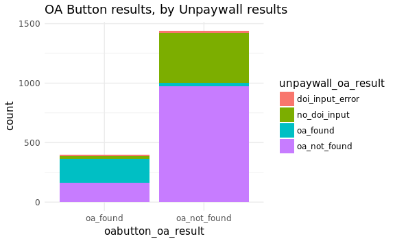
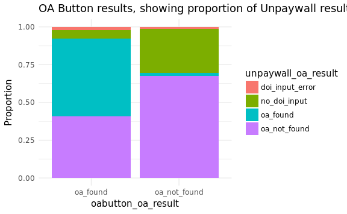

ILL Summary of OA Sources
================
Jessica Minnier
2018-08-17

-   [Table of OA Results](#table-of-oa-results)
    -   [OA Button](#oa-button)
    -   [Unpaywall](#unpaywall)
    -   [Crosstab](#crosstab)
-   [Total found](#total-found)

Table of OA Results
===================

OA Button
---------

``` r
res %>% tabyl(oabutton_oa_result) %>% adorn_totals() %>% adorn_pct_formatting()
```

| oabutton\_oa\_result |     n| percent |
|:---------------------|-----:|:--------|
| oa\_found            |   397| 21.6%   |
| oa\_not\_found       |  1442| 78.4%   |
| Total                |  1839| 100.0%  |

``` r
res %>% ggplot(aes(x=institution,fill=oabutton_oa_result)) + 
  geom_bar(position = "dodge") + 
  theme_minimal()
```


Unpaywall
---------

``` r
res %>% tabyl(unpaywall_oa_result) %>% adorn_totals() %>% adorn_pct_formatting() 
```

| unpaywall\_oa\_result |     n| percent |
|:----------------------|-----:|:--------|
| doi\_input\_error     |    25| 1.4%    |
| no\_doi\_input        |   444| 24.1%   |
| oa\_found             |   233| 12.7%   |
| oa\_not\_found        |  1137| 61.8%   |
| Total                 |  1839| 100.0%  |

``` r
res %>% ggplot(aes(x=institution,fill=unpaywall_oa_result)) + geom_bar(position = "dodge") + 
  theme_minimal()
```


Crosstab
--------

Note OA button found some OA articles that did not have a doi, as well as some articles that had a doi. Unpaywall just found a few extra articles.

Below is % (*n*) where % is percent of total number of queries 1839 and *n* is number of queries. The columns are unpaywall results and the rows are OA button results.

``` r
res %>% tabyl(oabutton_oa_result, unpaywall_oa_result) %>% 
  adorn_totals(where = c("row","col")) %>%
  adorn_percentages(denominator = "all") %>%
  adorn_pct_formatting() %>% 
  adorn_ns() %>%
  adorn_title("combined") 
```

| oabutton\_oa\_result/unpaywall\_oa\_result | doi\_input\_error | no\_doi\_input | oa\_found   | oa\_not\_found | Total         |
|:-------------------------------------------|:------------------|:---------------|:------------|:---------------|:--------------|
| oa\_found                                  | 0.4% (8)          | 1.3% (23)      | 11.1% (204) | 8.8% (162)     | 21.6% (397)   |
| oa\_not\_found                             | 0.9% (17)         | 22.9% (421)    | 1.6% (29)   | 53.0% (975)    | 78.4% (1442)  |
| Total                                      | 1.4% (25)         | 24.1% (444)    | 12.7% (233) | 61.8% (1137)   | 100.0% (1839) |

As a proportion of queries with a DOI:

``` r
res %>% 
  filter(doi_present==1) %>%
  tabyl(oabutton_oa_result, unpaywall_oa_result) %>% 
  adorn_totals(where = c("row","col")) %>%
  adorn_percentages(denominator = "all") %>%
  adorn_pct_formatting() %>% 
  adorn_ns() %>%
  adorn_title("combined") 
```

| oabutton\_oa\_result/unpaywall\_oa\_result | doi\_input\_error | oa\_found   | oa\_not\_found | Total         |
|:-------------------------------------------|:------------------|:------------|:---------------|:--------------|
| oa\_found                                  | 0.6% (8)          | 14.6% (204) | 11.6% (162)    | 26.8% (374)   |
| oa\_not\_found                             | 1.2% (17)         | 2.1% (29)   | 69.9% (975)    | 73.2% (1021)  |
| Total                                      | 1.8% (25)         | 16.7% (233) | 81.5% (1137)   | 100.0% (1395) |

``` r
res %>% ggplot(aes(x=oabutton_oa_result,fill=unpaywall_oa_result)) + geom_bar() + 
  theme_minimal() + ggtitle("OA Button results, by Unpaywall results")
```



``` r
res %>% ggplot(aes(x=oabutton_oa_result,fill=unpaywall_oa_result)) + geom_bar(position = "fill") +
  ylab("Proportion")+
  theme_minimal() + ggtitle("OA Button results, showing proportion of Unpaywall results")
```



Total found
===========

``` r
res %>% 
  mutate(oa_by_either_method = 
                 ifelse(
                   (unpaywall_oa_result=="oa_found")|(oabutton_oa_result=="oa_found"), "oa_found", "oa_not_found")) %>%
  tabyl(oa_by_either_method) %>% adorn_totals() %>% adorn_pct_formatting()
```

| oa\_by\_either\_method |     n| percent |
|:-----------------------|-----:|:--------|
| oa\_found              |   426| 23.2%   |
| oa\_not\_found         |  1413| 76.8%   |
| Total                  |  1839| 100.0%  |
