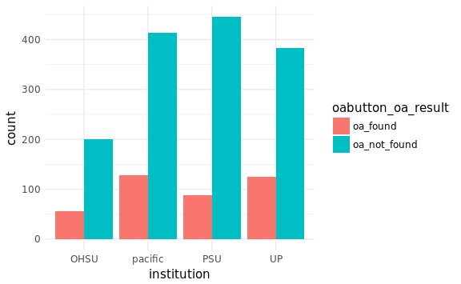
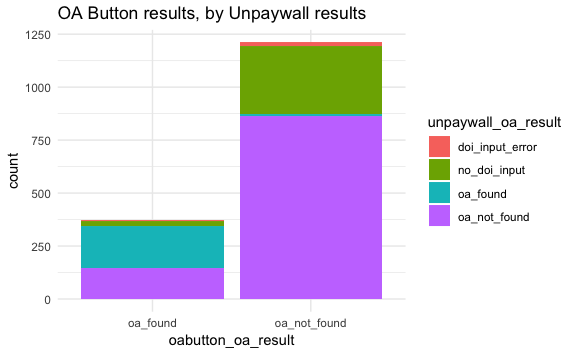
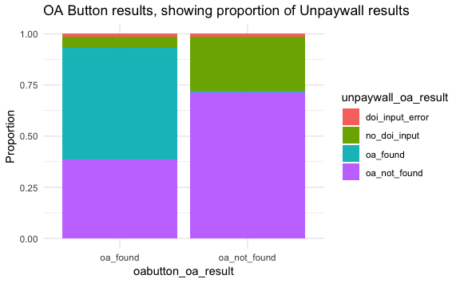

ILL Summary of OA Sources
================
Jessica Minnier
2018-08-10

-   [Table of OA Results](#table-of-oa-results)
    -   [OA Button](#oa-button)
    -   [Unpaywall](#unpaywall)
    -   [Crosstab](#crosstab)
-   [Total found](#total-found)

Table of OA Results
===================

OA Button
---------

``` r
res %>% tabyl(oabutton_oa_result) %>% adorn_totals() %>% adorn_pct_formatting()
```

| oabutton\_oa\_result |     n| percent |
|:---------------------|-----:|:--------|
| oa\_found            |   372| 23.5%   |
| oa\_not\_found       |  1211| 76.5%   |
| Total                |  1583| 100.0%  |

``` r
res %>% ggplot(aes(x=institution,fill=oabutton_oa_result)) + 
  geom_bar(position = "dodge") + 
  theme_minimal()
```



Unpaywall
---------

``` r
res %>% tabyl(unpaywall_oa_result) %>% adorn_totals() %>% adorn_pct_formatting() 
```

| unpaywall\_oa\_result |     n| percent |
|:----------------------|-----:|:--------|
| doi\_input\_error     |    20| 1.3%    |
| no\_doi\_input        |   344| 21.7%   |
| oa\_found             |   210| 13.3%   |
| oa\_not\_found        |  1009| 63.7%   |
| Total                 |  1583| 100.0%  |

``` r
res %>% ggplot(aes(x=institution,fill=unpaywall_oa_result)) + geom_bar(position = "dodge") + 
  theme_minimal()
```


Crosstab
--------

Note OA button found some OA articles that did not have a doi, as well as some articles that had a doi. Unpaywall just found a few extra articles.

Below is % (*n*) where % is percent of total number of queries 1583 and *n* is number of queries. The columns are unpaywall results and the rows are OA button results.

``` r
res %>% tabyl(oabutton_oa_result, unpaywall_oa_result) %>% 
  adorn_totals(where = c("row","col")) %>%
  adorn_percentages(denominator = "all") %>%
  adorn_pct_formatting() %>% 
  adorn_ns() %>%
  adorn_title() 
```

|                      | unpaywall\_oa\_result |                |             |                |               |
|----------------------|:----------------------|----------------|-------------|----------------|---------------|
| oabutton\_oa\_result | doi\_input\_error     | no\_doi\_input | oa\_found   | oa\_not\_found | Total         |
| oa\_found            | 0.3% (5)              | 1.3% (21)      | 12.8% (202) | 9.1% (144)     | 23.5% (372)   |
| oa\_not\_found       | 0.9% (15)             | 20.4% (323)    | 0.5% (8)    | 54.6% (865)    | 76.5% (1211)  |
| Total                | 1.3% (20)             | 21.7% (344)    | 13.3% (210) | 63.7% (1009)   | 100.0% (1583) |

``` r
res %>% ggplot(aes(x=oabutton_oa_result,fill=unpaywall_oa_result)) + geom_bar() + 
  theme_minimal() + ggtitle("OA Button results, by Unpaywall results")
```



``` r
res %>% ggplot(aes(x=oabutton_oa_result,fill=unpaywall_oa_result)) + geom_bar(position = "fill") +
  ylab("Proportion")+
  theme_minimal() + ggtitle("OA Button results, showing proportion of Unpaywall results")
```



Total found
===========

``` r
res %>% 
  mutate(oa_by_either_method = 
                 ifelse(
                   (unpaywall_oa_result=="oa_found")|(oabutton_oa_result=="oa_found"), "oa_found", "oa_not_found")) %>%
  tabyl(oa_by_either_method) %>% adorn_totals() %>% adorn_pct_formatting()
```

| oa\_by\_either\_method |     n| percent |
|:-----------------------|-----:|:--------|
| oa\_found              |   380| 24.0%   |
| oa\_not\_found         |  1203| 76.0%   |
| Total                  |  1583| 100.0%  |
